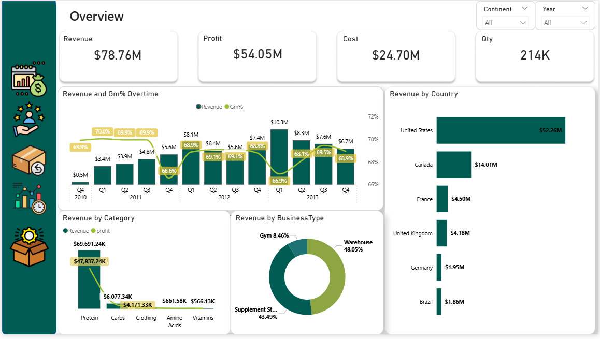
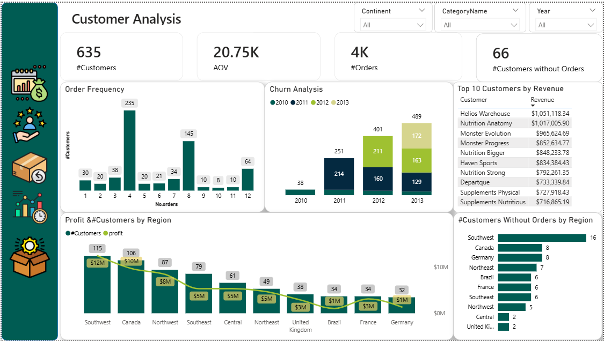
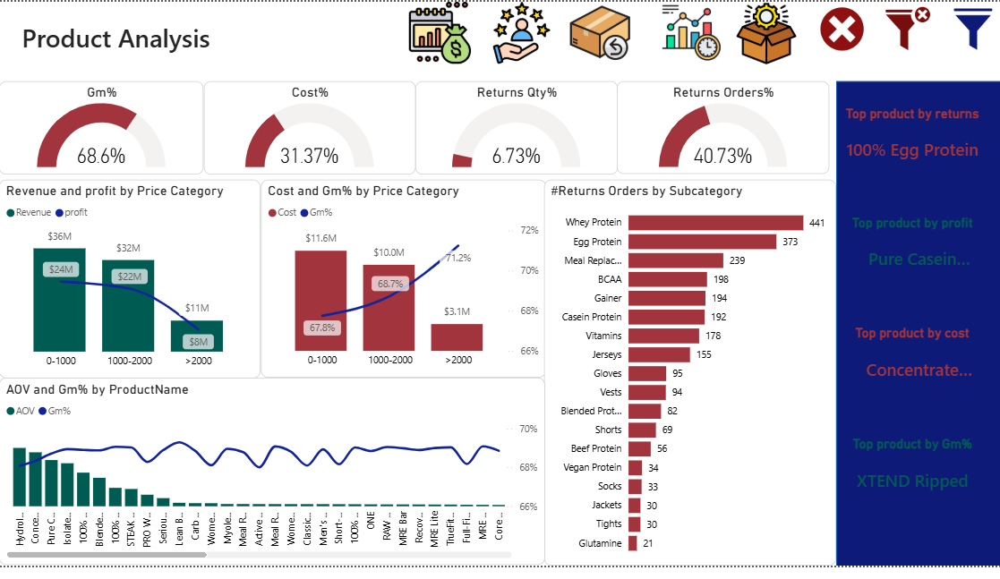
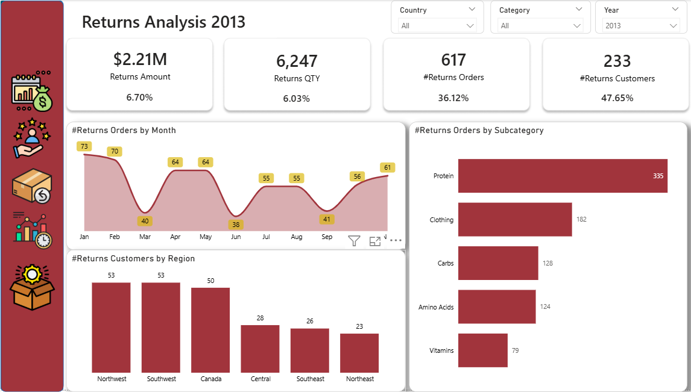
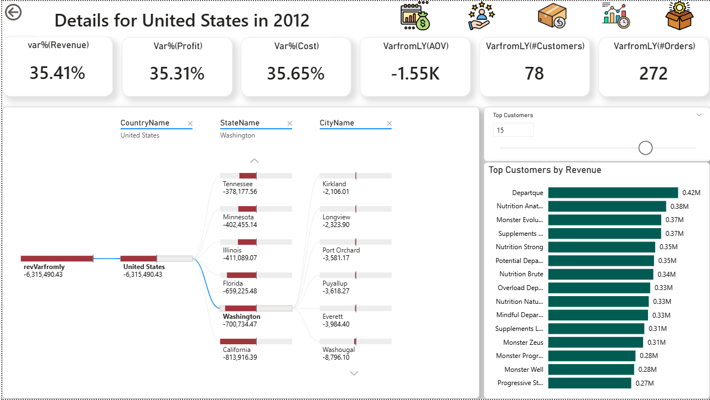
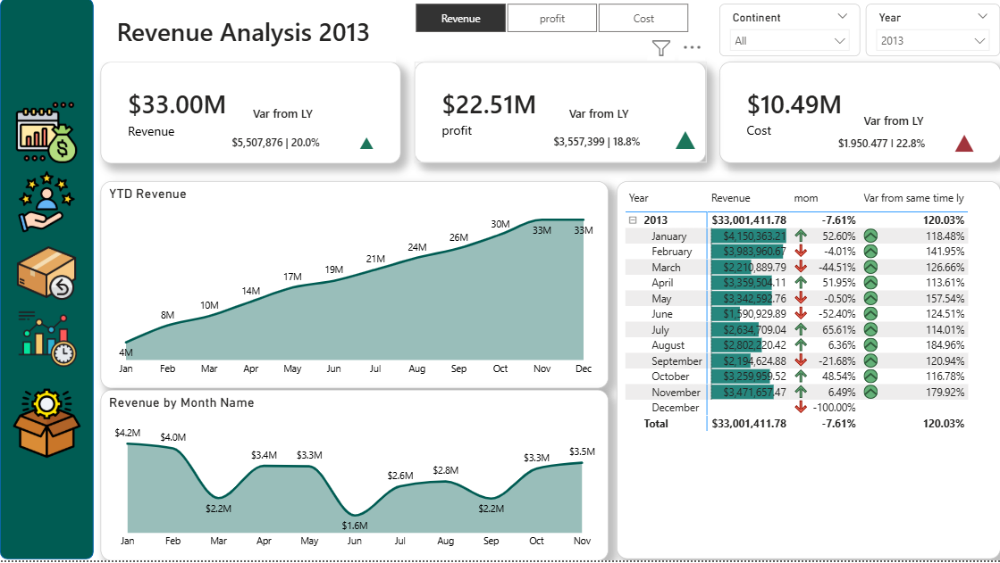

# 🚀 Fitness Products & Supplements Dashboard (Power BI)

## 📌 Overview

In a data-rich environment, having numbers isn’t enough — the real value comes from turning those numbers into **decisions**.
This Power BI dashboard was built to act as a **single source of truth**, helping the business understand performance, detect issues early, and uncover growth opportunities across sales, customers, products, and regions.

---

## 📊 Business Snapshot

The dashboard consolidates key performance indicators into one clear view, tracking **$78.76M in revenue**, **$54.05M in profit**, and **214K orders**, alongside an **8.12% return rate** — giving stakeholders an instant understanding of overall business health.

---

## 🔍 From Data to Insights

Instead of just presenting numbers, the dashboard focuses on answering real business questions:

* Why are some customers not contributing to revenue?
  → **66 inactive customers** were identified, highlighting a direct opportunity for targeted re-engagement campaigns.
  
* Are we really selling the “right” products?
  → By combining **AOV and Gross Margin**, the dashboard reveals that high revenue doesn’t always mean high profitability, helping prioritize the products that truly drive value.

* What’s driving performance changes over time?
  → Regional and time-based analysis explains the key contributors behind **Year-over-Year performance shifts**.

---
## ⚙️ How It Was Built

To support these insights, the dashboard was designed with both business logic and usability in mind.
Advanced **DAX measures** power time intelligence calculations (YTD, MoM, YoY), while dynamic KPI cards provide instant visual feedback using performance indicators (↑ / ↓).

A **decomposition tree** enables deep root-cause analysis, and interactive slicers (date, region, category) allow users to explore the data from multiple perspectives without complexity.

---

## 🛠 Tools

* Power BI
* power Query for ETL
* DAX

---

## 📸 Dashboard Preview

### Overview

### Customer Analysis

### Product Analysis

### Returns Analysis

### Location Analysis

### Time Analysis

---

## 🚀 How to Use

Open the `.pbit` file in Power BI Desktop and interact with the dashboard using slicers to explore insights and drill down into performance drivers.

---

## 📬 Contact

* LinkedIn: (https://www.linkedin.com/in/abdelrahman-wahba-1066a633a?originalSubdomain=eg)

---

## 💡 Final Note

This project focuses on bridging the gap between **data and decision-making** — transforming raw numbers into insights that can directly impact business strategy.
